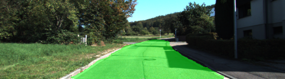

# CarND-Semantic-Segmentation-Project
### Introduction
In this project a fully convolutional neural network for the purpose of semantic image segmentation is constructed on the basis of the well known [VGG-16 architecture](https://arxiv.org/pdf/1409.1556.pdf), following roughly the ideas and concepts outlined [here](https://arxiv.org/pdf/1605.06211v1.pdf).
The final architecture is trained on the [Kitti Road dataset](http://www.cvlibs.net/datasets/kitti/eval_road.php) which enables the network to perform the semantic segmentation task of identify the pixels corresponding to a road in an image.

### Solution approach
The neural network designed to perform semantic segmentation harnesses a pre-trained VGG-16 network. As a first step, the last and fully connected layer of the VGG-16 network is replaced with a 1x1 convolutional layer. In addition, several de-convolutional layers are introduced as decoder part of the network.
Skip connections are are used to improve the performance of the model.

### Training
An Adam-Optimizer with an initial learning rate of 0.001 is used to minimize the cross-entropy-loss of the network.
The batch-size was set to 10 and the network was trained to 50 epochs.


### Results
After training the network for 50 epochs, the network is fairly accurate in identifying the drivable portion of the road in an image. Some sample images showcasing the performance of the network are shown below.




### Setup
##### Frameworks and Packages
To run the code, make sure you have the following is installed:
 - [Python 3](https://www.python.org/)
 - [TensorFlow](https://www.tensorflow.org/)
 - [NumPy](http://www.numpy.org/)
 - [SciPy](https://www.scipy.org/)

##### Dataset
Download the [Kitti Road dataset](http://www.cvlibs.net/datasets/kitti/eval_road.php) from [here](http://www.cvlibs.net/download.php?file=data_road.zip).  Extract the dataset in the `data` folder.  This will create the folder `data_road` with all the training a test images.

##### Run
Run the following command to run the project:
```
python main.py
```
